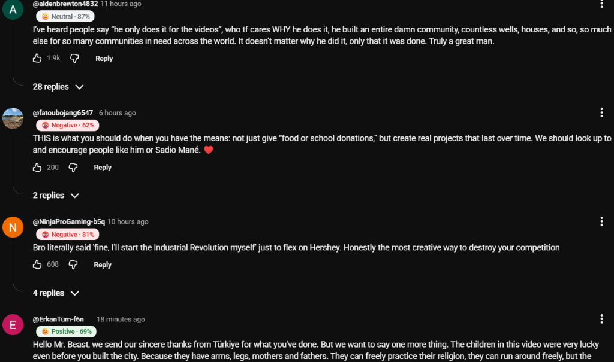
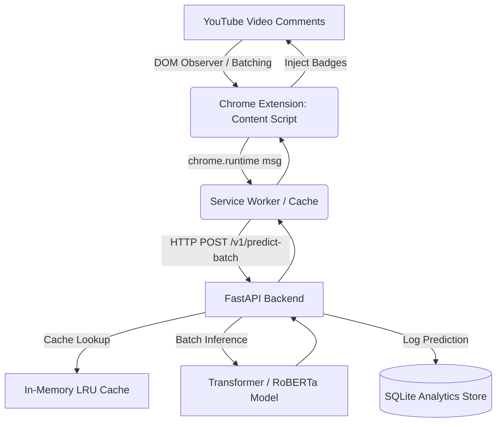

# Real-Time YouTube Comments Sentiment Analysis with MLOps

[](https://www.python.org/)
[](https://fastapi.tiangolo.com/)
[](https://huggingface.co/cardiffnlp/twitter-roberta-base-sentiment-latest)
[](https://developer.chrome.com/docs/extensions/)
[](https://dvc.org/)
[](https://mlflow.org/)

An end-to-end, production-grade MLOps system that analyzes and visualizes the sentiment of YouTube comments **in real time** as you scroll through videos.

The system integrates a **Google Chrome Extension (Manifest V3)** that embeds sentiment badges directly into the YouTube comment section, backed by a high-throughput **FastAPI server** powered by state-of-the-art pretrained transformer models (`cardiffnlp/twitter-roberta-base-sentiment-latest`), along with a full MLOps data pipeline (DVC + MLflow + SQLite prediction store).

---

## 📸 Real-Time End Result Preview

Here is the Chrome Extension actively predicting and rendering sentiments directly within the YouTube UI:



* Badges dynamically appear beside the commenter username.
* Shows classification label (`Positive`, `Neutral`, `Negative`) with color coding and visual icons.
* Shows calibrated confidence score percentage (e.g. `Positive · 69%`, `Negative · 81%`).
* Zero page disruption: YouTube's SPA navigation, dynamic DOM shifts, and lazy loading are supported smoothly.

---

## 🏛️ System Architecture



---

## ⚡ Key Features

1. **Manifest V3 Chrome Extension**:
   - 3-layer DOM fallback detection to survive YouTube layout changes.
   - Shadow DOM badges to prevent CSS collisions with YouTube's styles.
   - Smart chunking (≤50 comments) & text truncation (≤500 chars) ensuring API reliability.
   - Client-side deduplication & caching to eliminate redundant backend calls.

2. **Serving & Inference API (FastAPI)**:
   - Pluggable backends (`transformer` with Twitter-RoBERTa, `sklearn` TF-IDF baseline, or `dummy`).
   - Built-in LRU cache & sliding-window IP rate limiting.
   - SQLite logging of all predictions and user feedback for continuous model retraining.

3. **Complete MLOps Pipeline**:
   - **DVC Pipeline**: Reproducible stages (`ingest` → `validate` → `prepare` → `train` → `evaluate`).
   - **MLflow Tracking**: Model metrics, macro F1 evaluation gating, and model registry support.
   - **GitHub Actions CI/CD**: Automated linting, pytest contract suites, and deployment readiness checks.

---

## 🚀 Quick Start Guide

### 1. Clone & Setup Environment

```bash
git clone https://github.com/KHAGESH-46/yt-sentiment-mlops.git
cd yt-sentiment-mlops

# Create and activate virtual environment
python -m venv .venv
# On Windows:
.venv\Scripts\activate
# On Linux/macOS:
source .venv/bin/activate

# Install dependencies
pip install -r requirements.txt
pip install -r requirements-transformers.txt
```

### 2. Start the Backend API

```powershell
# Set backend to transformer (or sklearn / dummy)
$env:MODEL_BACKEND="transformer"
python -m uvicorn api.main:app --port 8000 --reload
```

Verify the API is running at [http://localhost:8000/health](http://localhost:8000/health). You should see:
```json
{
  "status": "ok",
  "model_version": "1.0.0-twt-roberta",
  "cache_hit_rate": 0.0
}
```

Interactive Swagger documentation is available at [http://localhost:8000/docs](http://localhost:8000/docs).

### 3. Load the Chrome Extension

1. Open Google Chrome and navigate to `chrome://extensions`.
2. Toggle on **Developer mode** (top right corner).
3. Click **Load unpacked** and select the [`extension`](extension/) directory from this repository.
4. Open any YouTube video (e.g., MrBeast), scroll down to the comment section, and watch the badges populate in real time!

---

## 📡 API Contract (Frozen `/v1`)

| Method | Endpoint | Description |
|---|---|---|
| `POST` | `/v1/predict-batch` | Accepts up to 50 comments per request; returns labels, confidence, and model version. |
| `POST` | `/v1/feedback` | Captures explicit user feedback/corrections to store for dataset enrichment. |
| `GET` | `/v1/model/current` | Version handshake endpoint used by the extension on startup. |
| `GET` | `/health` | Health status, current model version, cache hit rate, and store counts. |

---

## 📁 Repository Layout

```
yt-sentiment-mlops/
├── api/                  # FastAPI serving application
│   ├── cache.py          # LRU Cache implementation
│   ├── inference.py      # Pluggable model backends (RoBERTa, sklearn, dummy)
│   ├── main.py           # FastAPI entrypoint and endpoints
│   ├── schemas.py        # Pydantic contract schemas
│   └── store.py          # SQLite analytics & feedback store
├── docs/                 # Documentation & architectural diagrams
│   ├── architecture.md   # Architectural design details
│   ├── runtime-sequence.md# Sequence diagrams
│   └── assets/           # Live preview screenshots and graphics
├── extension/            # Chrome Extension (Manifest V3)
│   ├── background.js     # Background service worker & API gateway
│   ├── content.js        # DOM observer, badge injection & rendering
│   ├── manifest.json     # Extension manifest
│   ├── popup.html/js     # Extension configuration & diagnostics popup
│   └── selectors.json    # YouTube DOM selector configurations
├── models/               # Local models, eval metrics, and registry artifacts
├── src/                  # MLOps Pipeline stages
│   ├── ingestion.py      # YouTube comment extraction
│   ├── validate.py       # Data validation & schema checks
│   ├── prepare.py        # Text cleaning and preprocessing
│   ├── train.py          # Baseline model training with MLflow
│   └── evaluate.py       # Evaluation and macro-F1 gating
├── tests/                # Automated pytest test suite
├── dvc.yaml              # DVC multi-stage pipeline configuration
├── params.yaml           # Pipeline hyperparameters
└── requirements.txt      # Python dependencies
```

---

## 🛠️ Testing

Run the automated test suite with `pytest`:

```bash
pytest tests/ -v
```

---

## 👤 Author

* **Khagesh Attarde**
* GitHub: [@KHAGESH-46](https://github.com/KHAGESH-46)
* Email: [kpattarde22@gmail.com](mailto:kpattarde22@gmail.com)
