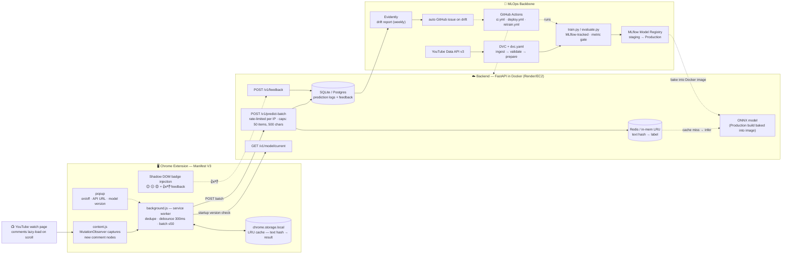
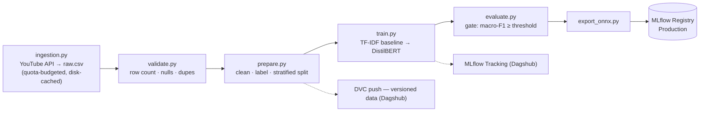
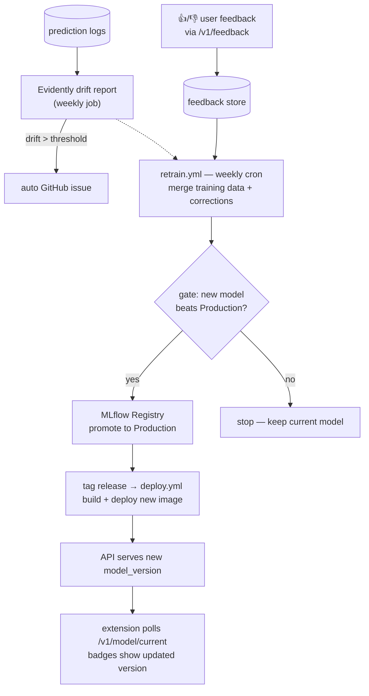

# Architecture Diagrams (Mermaid) — Option A

> Paste these into any Mermaid renderer (GitHub READMEs render `.mermaid`/```` ```mermaid ```` blocks natively).
> Diagram 1 = full system · Diagram 2 = training pipeline (dvc.yaml stages) · Diagram 3 = closed retrain loop.

---

## 1. Main System Architecture



---

## 2. Training / Data Pipeline

> Each box = one stage in `dvc.yaml` (with `deps`, `params`, `outs`). `dvc repro` runs the whole chain.



---

## 3. Closed Retrain Loop (flagship feature)



---

## How to read Diagram 1 (3-minute demo script)

1. **Runtime (solid arrows, top):** user scrolls → content script catches new comments → service worker batches them → API checks cache → cache miss hits the ONNX model → label + confidence return → badge injected next to username. Every prediction is logged.
2. **Build-time (middle):** YouTube API → DVC-versioned pipeline → MLflow-tracked training → gated evaluation → Production model in registry → CI bakes it into the Docker image and deploys.
3. **Monitoring (bottom):** logs feed Evidently weekly → drift over threshold opens a GitHub issue → retrain workflow can consume logs + user feedback → only promotes if it beats the current model.
