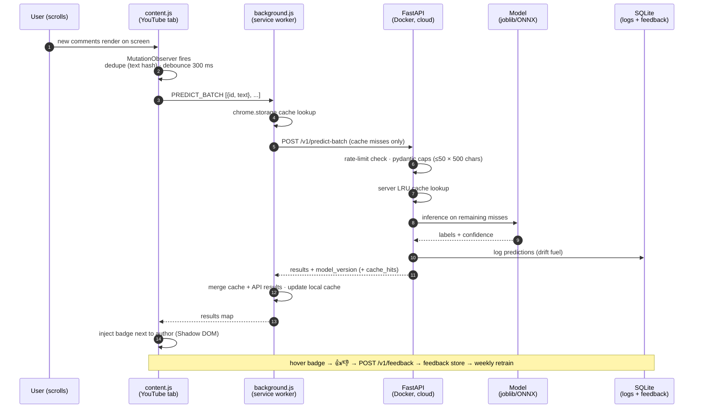

# Runtime Sequence — comment → badge (explain the debounce/batch behavior)

Why it feels real-time: the observer catches comments the moment YouTube renders
them, batching means one API call per scroll-burst (not one per comment), and the
two-level cache means repeat comments cost zero inference.
